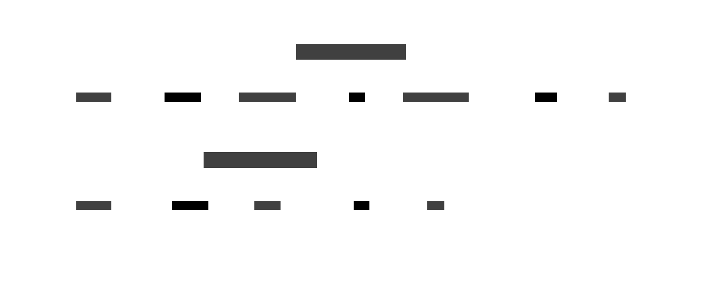
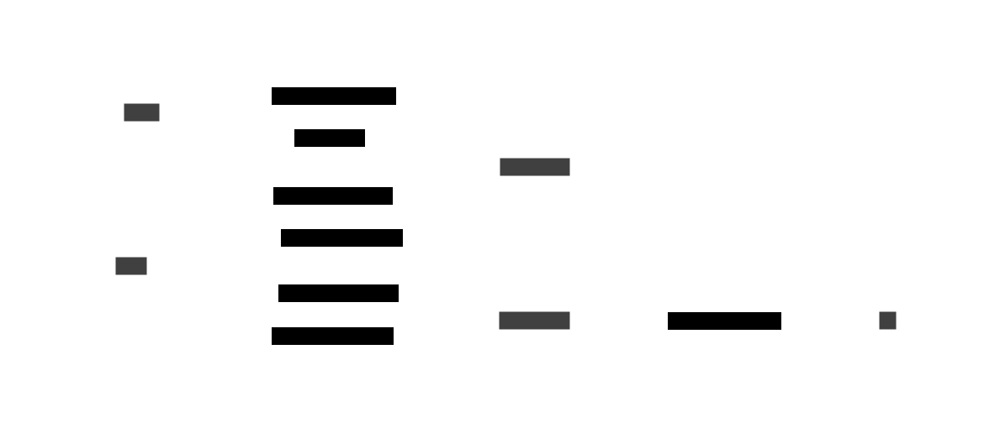
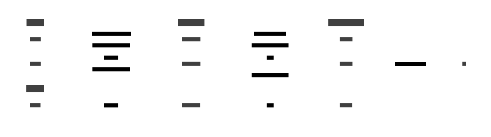
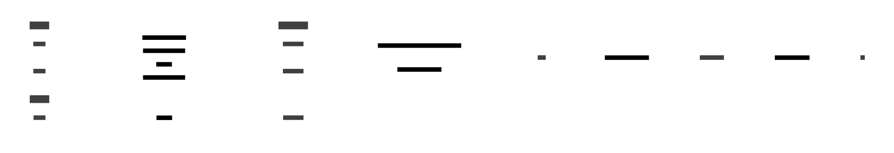

- [Demo (TODO)](#demo-todo)
- [Architecture](#architecture)
- [Frontend](#frontend)
- [DB](#db)
- [gRPC](#grpc)
- [NATS](#nats)
- [gRPC vs NATS](#grpc-vs-nats)
  - [Login gRPC](#login-grpc)
  - [Login NATS](#login-nats)
  - [Chat gRPC](#chat-grpc)
  - [Chat NATS](#chat-nats)

## Demo (TODO)

## Architecture

There are two versions: one with [gRPC](https://grpc.io/) and the other with [NATS](https://nats.io/)

  <picture>
  
  </picture>
  <picture>
  
  </picture>

## Frontend

[HTMX](https://htmx.org/) is a small JavaScript library that simplifies the development of server-side-rendered web applications.

By simply adding attributes to HTML elements (`hx-get`, `hx-post`, `hx-delete`, and so on) and specifying the server endpoints, these elements can initiate an HTTP request to the server.

The body of the HTTP response contains the HTML that will replace either the caller element or the target specified by `hx-target`. This allows for some neat, easy-to-implement patterns like [Infinite Scroll](https://htmx.org/examples/infinite-scroll/).

HTMX, combined with an HTML templating tool (my favorite being [quicktemplate](https://github.com/valyala/quicktemplate/)), enables a very short feedback loop in development.

Assuming a generic datasource (DB or other services) to generate dynamic content, the typical involved steps are:

<picture>
  
</picture>

By removing the frontend framework dependency (see [React](https://react.dev/), [Vue](https://vuejs.org/), [Svelte](https://svelte.dev/), [Angular JS](https://angularjs.org/), [Solid JS](https://www.solidjs.com/), [Qwik](https://qwik.builder.io/), and all the other never-ending new options), not only is there less cognitive overhead, but also the entire [npm](https://www.npmjs.com/) toolchain can be avoided (insert *Heaviest Objects In The Universe* meme here).

Based on the HTML templating tool, type safety is guaranteed, and there is no need to deal with the maintenance of the data API contract between the backend and frontend.

Other tools used for the frontend:
* [HTMX WebSockets Extension](https://htmx.org/extensions/web-sockets/): for bidirectional communication with the WebService
* [Pico CSS](https://picocss.com/): very light, semantic styling
* [Uno CSS](https://unocss.dev/): another CSS tool. Allows the use of utility class styling, like Tailwind CSS, but also allows the setting of some custom rules

## DB

[SQLite](https://www.sqlite.org/index.html) has been chosen as the database.

It doesn't require an active instance of a server: the data gets written into a file.

This also enables parallel testing: for each test, a new temporary database file with a clean state can be generated (see `GetSqliteTest` in [./config/sqlite.go](./config/sqlite.go)) without worrying about data races with other tests.

Worth mentioning is [sqlc](https://sqlc.dev/), a tool that generates type-safe Go structs and query functions from raw SQL. It supports MySQL, PostgreSQL, and SQLite.

## gRPC

[gRPC](https://grpc.io/) is a framework that makes use of [Protocol Buffers](https://protobuf.dev/) to define services and messages (in a `.proto` file) between clients and servers. There are some tools that can then generate files of these messages and services for multiple programming languages.

My recommendation is [Buf](https://buf.build/docs/bsr/remote-plugins/usage), which simplifies the complexity of working with `protoc` and local tools by running remote plugins.

These generated files contain all the needed structs and functions to make service calls and to encode and decode messages in and from binary format. This enables a smaller payload size and increases the speed of communication for large amounts of data.

Then, all that is needed for the server is to write a struct that implements the generated service interface.

gRPC also allows mono- and bidirectional streaming through a long-lived connection between the client and server.

## NATS

[NATS](https://nats.io/) is an open-source, lightweight, high-performance, cloud-native infrastructure messaging system written in Go. It implements a highly scalable publish-subscribe (pub/sub) distribution model.

It is easy to install and run: all that is needed is the [binary executable](https://github.com/nats-io/nats-server/releases), which weighs less than 20 MB, and to run `nats-server` from the command line.

The [Go client API](https://github.com/nats-io/nats.go?tab=readme-ov-file#basic-usage) is also quite easy to follow and understand.

## gRPC vs NATS

### Login gRPC

In the gRPC version, the client makes an HTTP POST request with the credentials to the "login" endpoint of the WebService, which then initiates a gRPC request to the UserService.

The UserService validates the credentials against the data stored in the DB and sends a response back to the WebService, which then forwards the outcome to the client.

<picture>
</img>
</picture>

### Login NATS

In the NATS version, there is an extra layer: the WebService publishes a LoginEvent message to NATS to a subject to which UserService is subscribed. This message also contains the unique subject where the LoginReply should be published, and to which the WebService is subscribed, waiting for the outcome.

Then the UserService receives the LoginEvent message, checks the credentials, and publishes the LoginReply to the requested subject.

<picture>
</img>
</picture>

### Chat gRPC

After an initial handshake, clients are connected to the WebService through WebSockets. The WebService initiates a gRPC bidirectional stream with the MessageService for each connected WebSocket client.

The MessageService keeps track of all open streams and their corresponding room ID.

When a client sends a message to the chat, it is forwarded to the WebService and then to the MessageService. The message is saved in the DB and then broadcasted to all WebService gRPC streams that have the same room ID as the message.

The WebService then writes the received message to all corresponding WebSocket connections.

A more appropriate approach could have been to simply have a unidirectional stream (from WebService to MessageService) and have WebService keep track of all connections' room IDs, but implementing and testing a gRPC bidirectional streaming looked cooler ¯\\_(ツ)_/¯

<picture>
  
</picture>

### Chat NATS

NATS simplifies the broadcasting aspect. For each WebSocket connection, there is a NATS subscription to the room subject. Each sent chat message is then published to NATS to the corresponding room subject, which broadcasts it back to all the listeners.

The MessageService also has a NATS subscription, but it includes all the rooms. Its task is to simply store each received message in the database.

<picture>
  
</picture>